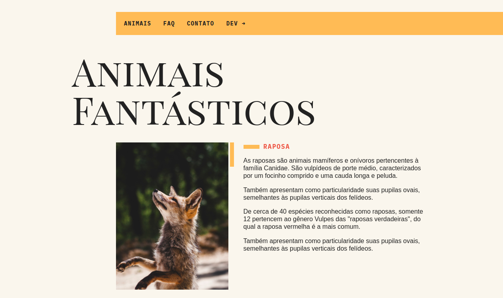

# Animais Fantásticos 🚧

Projeto proposto pelo curso de JavaScript Completo ES6 da instituição de ensino Origamid.
Consiste em um site fictício que fala sobre características de alguns animais.
A estrutura HTML e o CSS vem pronto pois o foco do curso é a implementação do JavaScript

## Demonstração

## Objetivo

Por em prática o aprendizado sobre JavaScript e interação com o DOM.
